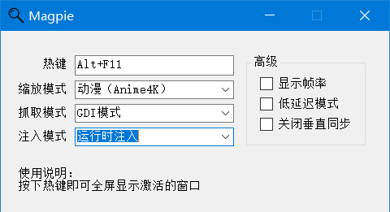
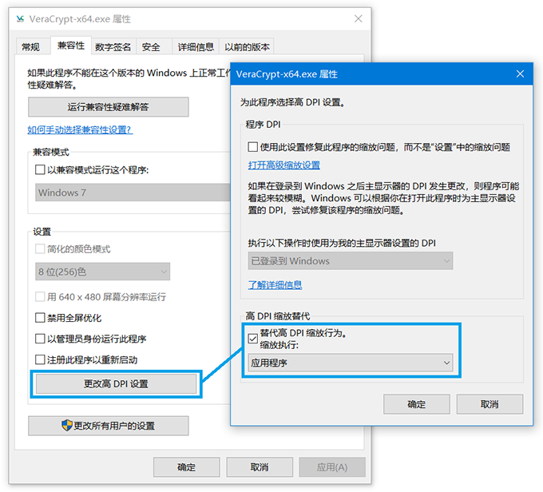

# MAGPIE

Magpie 可以将任意窗口放大至全屏，支持多种高级缩放算法，包括 Lanczos、[Anime4K](https://github.com/bloc97/Anime4K)、[FSR](https://github.com/GPUOpen-Effects/FidelityFX-FSR)、[FSRCNNX](https://github.com/igv/FSRCNN-TensorFlow)等。

主要用于游戏窗口的放大显示，适用于不支持全屏模式，或者内置的全屏模式会使画面模糊的情况。

使用中遇到问题请提交 issue。

☛ [编译指南](https://github.com/Blinue/Magpie/wiki/编译指南)

☛ [FAQ](https://github.com/Blinue/Magpie/wiki/FAQ)

☛ [自定义缩放配置](https://github.com/Blinue/Magpie/wiki/自定义缩放配置)

☛ [贡献指南](https://github.com/Blinue/Magpie/blob/master/CONTRIBUTING.md)

## 使用方法

要放大的窗口位于前台时，按下热键即可全屏显示该窗口，再次按下热键或者切换前台窗口将退出全屏。

以下为配置说明：

#### 热键修改

程序使用[globalmousekeyhook](https://github.com/gmamaladze/globalmousekeyhook)检测热键。

手动输入键值修改为你喜欢的键位（多个键位组合之间用 `+` 连接）

1. 字母使用大写，如 `A` ；数字使用特殊格式，如 `D1` （小键盘数字则为 `NumPad1` ）
2. 功能键的单词首字母大写，如 `Capital` （不能写 `Caps` ）， `F1` ， `PageUp`
3. 个别键位不能作为单独的触发热键，必须与其它键位组合使用，如 `Control` ， `Shift` ， `Alt`
4. 组合键按照前后顺序按下才能正确触发，如 `B+C` （先按住b不松手而后再按下c）

#### 缩放模式

程序预置了多种缩放模式，如果它们不符合你的需求，请[自定义缩放配置](https://github.com/Blinue/Magpie/wiki/自定义缩放配置)。

1. Lanczos：常见的传统插值算法，善于保留锐利的边缘。
2. FSR：[FidelityFX-FSR](https://github.com/GPUOpen-Effects/FidelityFX-FSR) 的移植，适合缩放 3D 游戏。
3. FSRCNNX：[FSRCNNX](https://github.com/igv/FSRCNN-TensorFlow) 的移植。
4. ACNet：[ACNetGLSL](https://github.com/TianZerL/ACNetGLSL)的移植。适合动画风格的图像和视频放大。
5. Anime4K：开源的高质量的实时动漫缩放/降噪算法。
6. RAVU：见 [About RAVU](https://github.com/bjin/mpv-prescalers#about-ravu)。此预置使用 zoom 变体。
7. Integer Scale：将每个像素放大整数倍，可以完整保留原图像的视觉效果。预置了2x和3x两种放大倍率。

#### 捕获模式

指示程序如何捕获源窗口图像。

1. Graphics Capture：使用 [Screen Capture API](https://docs.microsoft.com/en-us/windows/uwp/audio-video-camera/screen-capture) 捕获窗口，最推荐的方法。此 API 从 Windows 10, v1903 开始提供。
2. GDI：使用 GDI 捕获源窗口。和 Graphics Capture 相比 CPU 占用更少。
3. DwmSharedSurface：使用未公开的 DwmSharedSurface API 捕获窗口。

## 使用提示

1. 如果你设置了 DPI 缩放，而要放大的窗口不支持（表现为画面模糊），建议首先进入该程序的兼容性设置，将“高 DPI 缩放替代”设置为“应用程序”。

   

2. 一些游戏支持调整窗口的大小，但只是简单的使用线性缩放，这时请先将其设为原始分辨率。

## 贡献者 ✨

感谢每一位贡献者，你们使 Magpie 变得更好（[emoji key](https://allcontributors.org/docs/en/emoji-key)）：

<!-- ALL-CONTRIBUTORS-LIST:START - Do not remove or modify this section -->
<!-- prettier-ignore-start -->
<!-- markdownlint-disable -->
<table>
  <tr>
    <td align="center"><a href="https://github.com/Blinue"> <b>刘旭</b></a> <a href="#maintenance-Blinue" title="Maintenance">🚧</a> <a href="https://github.com/Blinue/Magpie/commits?author=Blinue" title="Code">💻</a> <a href="https://github.com/Blinue/Magpie/pulls?q=is%3Apr+reviewed-by%3ABlinue" title="Reviewed Pull Requests">👀</a> <a href="https://github.com/Blinue/Magpie/commits?author=Blinue" title="Documentation">📖</a> <a href="#question-Blinue" title="Answering Questions">💬</a></td>
    <td align="center"><a href="https://github.com/hooke007"> <b>hooke007</b></a> <a href="https://github.com/Blinue/Magpie/commits?author=hooke007" title="Documentation">📖</a> <a href="#question-hooke007" title="Answering Questions">💬</a> <a href="#userTesting-hooke007" title="User Testing">📓</a></td>
    <td align="center"><a href="http://palxex.ys168.com"> <b>Pal Lockheart</b></a> <a href="#userTesting-palxex" title="User Testing">📓</a></td>
    <td align="center"><a href="https://www.stevedonaghy.com/"> <b>Steve Donaghy</b></a> <a href="https://github.com/Blinue/Magpie/commits?author=neoKushan" title="Code">💻</a> <a href="#translation-neoKushan" title="Translation">🌍</a></td>
    <td align="center"><a href="http://gyrojeff.top"> <b>gyro永不抽风</b></a> <a href="https://github.com/Blinue/Magpie/commits?author=JeffersonQin" title="Code">💻</a></td>
    <td align="center"><a href="https://github.com/ButtERRbrod"> <b>ButtERRbrod</b></a> <a href="#translation-ButtERRbrod" title="Translation">🌍</a></td>
  </tr>
</table>

<!-- markdownlint-restore -->
<!-- prettier-ignore-end -->

<!-- ALL-CONTRIBUTORS-LIST:END -->

本项目遵循 [all-contributors](https://github.com/all-contributors/all-contributors) 规范。欢迎任何形式的贡献！
