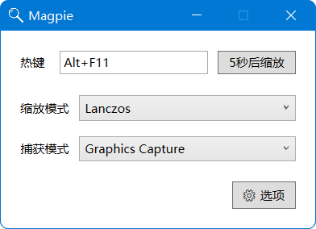

# MAGPIE

窗口放大镜！

可以将任意窗口全屏显示，支持高级缩放算法，包括[Anime4K](https://github.com/bloc97/Anime4K)（本项目包含一个Direct2D移植）、Lanczos等。

主要用于游戏窗口的放大显示，适用于那些不支持全屏模式，或者游戏自带的全屏模式会使画面模糊的情况。

使用中遇到问题请提交issue。

## 使用方法

程序启动后，激活要放大的窗口，按下热键即可全屏显示该窗口，再次按下热键或者切换前台窗口将退出全屏。

以下为配置说明：

#### 缩放模式

程序预置了数种缩放模式，如果没有符合你的需求的，请[自定义缩放](docs/自定义缩放.md)。

1. 通用：Lanczos+锐化
2. ACNet：[ACNetGLSL](https://github.com/TianZerL/ACNetGLSL)的移植
3. Anime4K：存在多种变体
   * 动漫 2x（Anime4K）：对输入应用一次Anime4K，适合放大1~2倍。默认使用降噪版本。
   * 动漫 2x（Anime4K+ThinLines）：执行Anime4K后细化线条。一般能产生更好的视觉效果。
   * 动漫 4x（Anime4K x2）：应用两次Anime4K，适合放大2~4倍的情况。
4. Pixel：将每个像素放大整数倍，可以完整保留原窗口的视觉效果。有2x，3x，4x三种放大倍率可选。

#### 抓取模式

指示程序如何抓取源窗口图像

1. WinRT Capture：使用[Screen Capture API](https://docs.microsoft.com/en-us/windows/uwp/audio-video-camera/screen-capture)抓取窗口，最推荐的方法。此API从Windows 10, v1803开始提供。
2. GDI：使用GDI抓取源窗口，速度稍慢

#### 注入模式

如果源程序使用了自定义光标，屏幕上可能出现两个光标，使用进程注入可解决这个问题

1. 不使用注入：适用于源窗口没有自定义光标的场合
2. 运行时注入：在窗口运行时按下热键可进入全屏并注入窗口，退出全屏后取消注入
3. 启动时注入：适用于运行时注入不起作用的场合，不能注入正在运行的进程，需要手动选择要启动并注入的程序

#### 高级选项

* 显示帧率：在屏幕左上角显示当前帧率

## 实现原理

如果你使用过[Lossless Scaling](https://store.steampowered.com/app/993090/Lossless_Scaling/)或[IntegerScaler](https://tanalin.com/en/projects/integer-scaler/)，我要告诉你的是，本项目和它们是完全不同的。Magpie的原理非常简单：使用一个全屏窗口覆盖屏幕，捕获原窗口的内容放大后在该全屏窗口显示出来。这种方式使得缩放算法不受任何限制，让我们可以自由使用现存的优秀缩放算法。

## 使用提示

1. 如果你设置了DPI缩放，而要放大的窗口不支持（表现为画面模糊），请首先进入该程序的兼容性设置，将“高DPI缩放替代”设置为“应用程序”。

   

2. 一些游戏支持调整窗口的大小，但只是简单的使用线性缩放，这时请先将其设为原始分辨率。

## 免责声明

因为使用了进程注入技术，本程序极有可能被报毒。出于安全考虑，您应该检查源代码并自行编译。

开发本程序的初衷不含有任何恶意，但使用它所造成的后果应由您自己承担。

参见[LICENSE](./LICENSE)。

## 鸣谢

感谢以下优秀项目，你们使Magpie的存在成为可能

* [bloc97/Anime4K](https://github.com/bloc97/Anime4K)
* [nlohmann/json](https://github.com/nlohmann/json)
* [Boost C++ Libraries](https://www.boost.org/)
* [EasyHook/EasyHook](https://github.com/EasyHook/EasyHook)
* [microsoft/cppwinrt](https://github.com/microsoft/cppwinrt)
* [libretro/common-shaders](https://github.com/libretro/common-shaders)
* [TianZerL/Anime4KCPP](https://github.com/TianZerL/Anime4KCPP)

