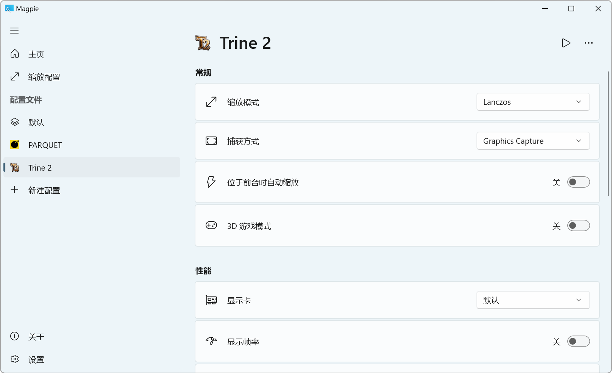

 

  

<h1 align="center">Magpie</h1>

🌍 [English](./README.md) | **简体中文**

Magpie 是一个轻量级的窗口缩放工具，内置了多种高效的缩放算法和滤镜。它主要用于提升游戏画质和让不支持全屏化的游戏也能全屏显示等。

我们使用 [Weblate](https://weblate.org) 进行本地化工作，请帮助我们把 Magpie 翻译成更多语言。

:point_right: [下载](https://github.com/Blinue/Magpie/releases)

:point_right: [FAQ](https://github.com/Blinue/Magpie/wiki/FAQ)

:point_right: [内置效果介绍](https://github.com/Blinue/Magpie/wiki/内置效果介绍)

:point_right: [编译指南](https://github.com/Blinue/Magpie/wiki/编译指南)

:point_right: [贡献指南](./CONTRIBUTING_ZH.md)

## 功能

* 将任何窗口放大至全屏
* 众多内置算法，包括 Lanczos、[Anime4K](https://github.com/bloc97/Anime4K)、[FSR](https://github.com/GPUOpen-Effects/FidelityFX-FSR)、Adaptive Sharpen、多种 CRT 着色器等
* 基于 WinUI 的用户界面，支持浅色和深色主题
* 为特定窗口创建配置文件
* 多屏幕支持

## 如何使用

1. 配置缩放模式

    Magpie 预设了一些简单的缩放模式，但建议根据使用场景自行配置。然后在“配置文件”-“默认”页面更改全局缩放模式。

2. 缩放窗口

    把要缩放的窗口置于前台，按下快捷键（默认为 Win+Shift+A）即可全屏显示。请注意，要缩放的窗口必须处于窗口化状态，而不是最大化或全屏化。也可以使用“主页”上的“x 秒后缩放”按钮，Magpie 将在数秒后自动缩放前台窗口。

3. 为窗口创建配置文件

    这使你可以保存针对某个窗口的配置，也支持在该窗口位于前台时自动执行缩放。
    
4. 自定义效果

    Magpie 使用 Direct3D 计算着色器实现效果，但扩展了语法来定义资源、组织多个通道等，详见 [MagpieFX](https://github.com/Blinue/Magpie/wiki/MagpieFX) 。有着色器编写经验者可以轻松创建自定义效果。

## 截图

## 系统需求

1. Windows 10 v1903+ 或 Windows 11
2. DirectX 功能级别 11

## 使用提示

1. 如果你设置了 DPI 缩放，而要放大的窗口没有高 DPI 支持（这在老游戏中很常见），推荐首先进入该程序的兼容性设置，将“高 DPI 缩放替代”设置为“应用程序”。
2. 一些游戏支持调整窗口的大小，但只使用简单的缩放算法，这时请先将其设为原始（最佳）分辨率。

## 贡献者 ✨

感谢每一位参与贡献的人：

<!-- ALL-CONTRIBUTORS-LIST:START - Do not remove or modify this section -->
<!-- prettier-ignore-start -->
<!-- markdownlint-disable -->
<table>
  <tbody>
    <tr>
      <td align="center" valign="top" width="14.28%"><a href="https://github.com/Blinue"> <b>Xu</b></a> <a href="#maintenance-Blinue" title="Maintenance">🚧</a> <a href="https://github.com/Blinue/Magpie/commits?author=Blinue" title="Code">💻</a> <a href="https://github.com/Blinue/Magpie/pulls?q=is%3Apr+reviewed-by%3ABlinue" title="Reviewed Pull Requests">👀</a> <a href="https://github.com/Blinue/Magpie/commits?author=Blinue" title="Documentation">📖</a> <a href="#question-Blinue" title="Answering Questions">💬</a></td>
      <td align="center" valign="top" width="14.28%"><a href="https://github.com/hooke007"> <b>hooke007</b></a> <a href="https://github.com/Blinue/Magpie/commits?author=hooke007" title="Documentation">📖</a> <a href="#question-hooke007" title="Answering Questions">💬</a> <a href="#userTesting-hooke007" title="User Testing">📓</a> <a href="https://github.com/Blinue/Magpie/commits?author=hooke007" title="Code">💻</a></td>
      <td align="center" valign="top" width="14.28%"><a href="http://palxex.ys168.com"> <b>Pal Lockheart</b></a> <a href="#userTesting-palxex" title="User Testing">📓</a></td>
      <td align="center" valign="top" width="14.28%"><a href="https://www.stevedonaghy.com/"> <b>Steve Donaghy</b></a> <a href="https://github.com/Blinue/Magpie/commits?author=neoKushan" title="Code">💻</a> <a href="#translation-neoKushan" title="Translation">🌍</a></td>
      <td align="center" valign="top" width="14.28%"><a href="http://gyrojeff.top"> <b>gyro永不抽风</b></a> <a href="https://github.com/Blinue/Magpie/commits?author=JeffersonQin" title="Code">💻</a></td>
      <td align="center" valign="top" width="14.28%"><a href="https://github.com/ButtERRbrod"> <b>ButtERRbrod</b></a> <a href="#translation-ButtERRbrod" title="Translation">🌍</a></td>
      <td align="center" valign="top" width="14.28%"><a href="https://github.com/0x4E69676874466F78"> <b>NightFox</b></a> <a href="#translation-0x4E69676874466F78" title="Translation">🌍</a></td>
    </tr>
    <tr>
      <td align="center" valign="top" width="14.28%"><a href="https://github.com/Tzugimaa"> <b>Tzugimaa</b></a> <a href="https://github.com/Blinue/Magpie/commits?author=Tzugimaa" title="Code">💻</a></td>
      <td align="center" valign="top" width="14.28%"><a href="https://github.com/WHMHammer"> <b>WHMHammer</b></a> <a href="#translation-WHMHammer" title="Translation">🌍</a></td>
      <td align="center" valign="top" width="14.28%"><a href="https://github.com/kato-megumi"> <b>kato-megumi</b></a> <a href="https://github.com/Blinue/Magpie/commits?author=kato-megumi" title="Code">💻</a></td>
      <td align="center" valign="top" width="14.28%"><a href="https://github.com/MikeWang000000"> <b>Mike Wang</b></a> <a href="#userTesting-MikeWang000000" title="User Testing">📓</a></td>
      <td align="center" valign="top" width="14.28%"><a href="http://sammyhori.com"> <b>Sammy Hori</b></a> <a href="#translation-sammyhori" title="Translation">🌍</a></td>
      <td align="center" valign="top" width="14.28%"><a href="https://github.com/NeilTohno"> <b>NeilTohno</b></a> <a href="#translation-NeilTohno" title="Translation">🌍</a></td>
      <td align="center" valign="top" width="14.28%"><a href="https://github.com/a0193143"> <b>a0193143</b></a> <a href="#translation-a0193143" title="Translation">🌍</a></td>
    </tr>
    <tr>
      <td align="center" valign="top" width="14.28%"><a href="https://github.com/soulset001"> <b>soulset001</b></a> <a href="#translation-soulset001" title="Translation">🌍</a></td>
      <td align="center" valign="top" width="14.28%"><a href="https://github.com/WluhWluh"> <b>WluhWluh</b></a> <a href="#design-WluhWluh" title="Design">🎨</a></td>
      <td align="center" valign="top" width="14.28%"><a href="https://github.com/SerdarSaglam"> <b>Serdar Sağlam</b></a> <a href="#translation-SerdarSaglam" title="Translation">🌍</a></td>
      <td align="center" valign="top" width="14.28%"><a href="https://github.com/AndrusGerman"> <b>Andrus Diaz German</b></a> <a href="#translation-AndrusGerman" title="Translation">🌍</a></td>
      <td align="center" valign="top" width="14.28%"><a href="https://github.com/Kefir2105"> <b>Kefir2105</b></a> <a href="#translation-Kefir2105" title="Translation">🌍</a></td>
      <td align="center" valign="top" width="14.28%"><a href="https://github.com/animeojisan"> <b>animeojisan</b></a> <a href="#translation-animeojisan" title="Translation">🌍</a></td>
      <td align="center" valign="top" width="14.28%"><a href="https://github.com/MuscularPuky"> <b>MuscularPuky</b></a> <a href="#translation-MuscularPuky" title="Translation">🌍</a></td>
    </tr>
    <tr>
      <td align="center" valign="top" width="14.28%"><a href="https://github.com/Zoommod"> <b>Zoommod</b></a> <a href="#translation-Zoommod" title="Translation">🌍</a></td>
      <td align="center" valign="top" width="14.28%"><a href="https://github.com/fil08"> <b>fil08</b></a> <a href="#translation-fil08" title="Translation">🌍</a></td>
      <td align="center" valign="top" width="14.28%"><a href="https://github.com/IsaiasYang"> <b>攸羚</b></a> <a href="https://github.com/Blinue/Magpie/commits?author=IsaiasYang" title="Code">💻</a></td>
      <td align="center" valign="top" width="14.28%"><a href="http://ohaiibuzzle.dev"> <b>OHaiiBuzzle</b></a> <a href="#translation-ohaiibuzzle" title="Translation">🌍</a></td>
      <td align="center" valign="top" width="14.28%"><a href="https://github.com/Rastadu23"> <b>Rastadu23</b></a> <a href="#translation-Rastadu23" title="Translation">🌍</a></td>
      <td align="center" valign="top" width="14.28%"><a href="https://github.com/hauuau"> <b>hauuau</b></a> <a href="https://github.com/Blinue/Magpie/commits?author=hauuau" title="Code">💻</a></td>
      <td align="center" valign="top" width="14.28%"><a href="https://github.com/nellydocs"> <b>nellydocs</b></a> <a href="#translation-nellydocs" title="Translation">🌍</a></td>
    </tr>
  </tbody>
</table>

<!-- markdownlint-restore -->
<!-- prettier-ignore-end -->

<!-- ALL-CONTRIBUTORS-LIST:END -->

本项目遵循 [all-contributors](https://allcontributors.org/) 规范。欢迎任何形式的贡献！
