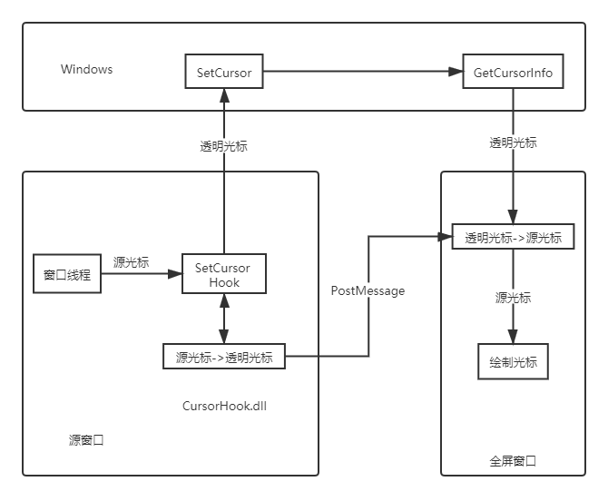

# Magpie中的光标映射

CursorHook的功能是隐藏源窗口中的光标，并在全屏窗口上绘制该光标。下图演示了它的工作原理：

1. Magpie使用[EasyHook](http://easyhook.github.io/)将CursorHook.dll注入源窗口进程，替换源窗口中的[SetCursor](https://docs.microsoft.com/en-us/windows/win32/api/winuser/nf-winuser-setcursor)
2. 源窗口试图使用SetCursor设置自定义光标
3. 注入程序维护一个源光标到对应透明光标的映射，首先在该映射中查找该光标。如果找到，使用该光标对应的透明光标调用系统的SetCursor，转到第7步；如果未找到，转到第4步
4. 创建一个热点相同的透明光标，创建新的映射
5. 使用PostMessage将该映射通知全屏窗口。全屏窗口维护着一个透明光标到源光标的映射，收到消息后创建该映射
6. 使用第4步创建的透明光标调用系统的SetCursor
7. 全屏窗口渲染时使用[GetCursorInfo](https://docs.microsoft.com/en-us/windows/win32/api/winuser/nf-winuser-getcursorinfo)获取当前光标，此时系统返回注入程序里设置的透明光标
8. 全屏窗口在映射中查找该透明光标，并在窗口上绘制其对应的源光标